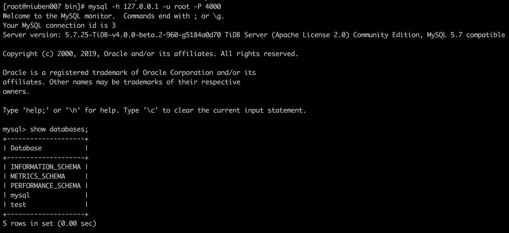
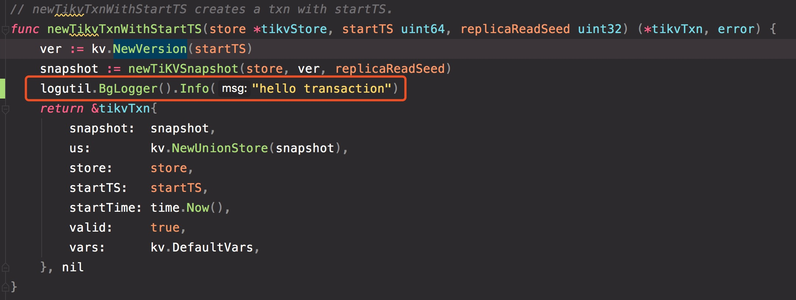
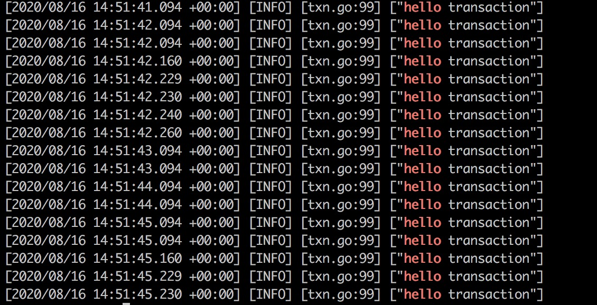

## 作业一
### 题目描述
 
本地下载 TiDB，TiKV，PD 源代码，改写源码并编译部署以下环境：

- 1 TiDB
- 1 PD
- 3 TiKV


改写后：使得 TiDB 启动事务时，能打印出一个 “hello transaction” 的 日志

### 要求

- 输出一篇文章介绍以上过程
- 截止时间：本周日 24:00:00（逾期不给分）
- 作业提交方式：提交至个人 github ，将链接发送给 talent-plan@tidb.io


### 解答
- 由于事务是在 TiDB 中实现，所以只需在 TiDB 源码中找到开启事务的地方，并添加一句打印日志的代码即可。
- TiDB 和 PD 都是 Golang 实现，安装 go 环境即可编译；TiKV 采用 rust 语言实现，编译比较复杂，时间主要耗费在编译 TiKV 部分，以下为具体过程。
### 环境准备 

CentOS Linux release 8.2 （[要求7.3以上](https://docs.pingcap.com/zh/tidb/stable/hardware-and-software-requirements)）

### 安装工具
```bash
yum install gcc-c++ git cmake3 make golang -y 
```

### 安装 Rust 环境
rust 需使用 nightly 版
```bash
curl https://sh.rustup.rs -sSf | sh -s
rustup override set nightly-x86_64-unknown-linux-gnu
```

### 编译 TiKV
```bash
git clone https://github.com/tikv/tikv.git
cd tikv
rustup component add rustfmt
rustup component add clippy
make build
```

### 编译 TiDB
```bash
git clone https://github.com/tikv/tidb.git
cd tidb
make
```

### 编译 PD
```bash
git clone https://github.com/tikv/pd.git
cd pd
make
```

### 依次启动
#### 启动 PD
```bash
./bin/pd-server --name=pd1 \
                --data-dir=pd1 \
                --client-urls="http://127.0.0.1:2379" \
                --peer-urls="http://127.0.0.1:2380" \
                --initial-cluster="pd1=http://127.0.0.1:2380" \
                --log-file=pd1.log
```

#### 启动 TiKV
```bash
./bin/tikv-server --pd-endpoints="127.0.0.1:2379" \
                --addr="127.0.0.1:20160" \
                --data-dir=tikv1 \
                --log-file=tikv1.log

./bin/tikv-server --pd-endpoints="127.0.0.1:2379" \
                --addr="127.0.0.1:20161" \
                --data-dir=tikv2 \
                --log-file=tikv2.log

./bin/tikv-server --pd-endpoints="127.0.0.1:2379" \
                --addr="127.0.0.1:20162" \
                --data-dir=tikv3 \
                --log-file=tikv3.log
```

#### 启动 TiDB
```bash
./bin/tidb-server --store=tikv --path=127.0.0.1:2379 --log-file=tidb.log
```
#### 使用 Mysql 客户端进行连接
```bash
mysql -h 127.0.0.1 -u root -P 4000
```


### 添加日志
阅读源码找到启动事务的地方

重新编译，查看日志
